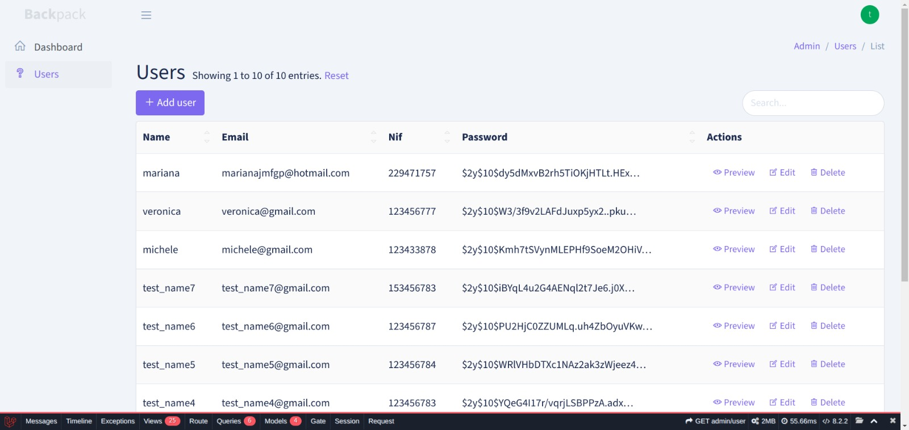
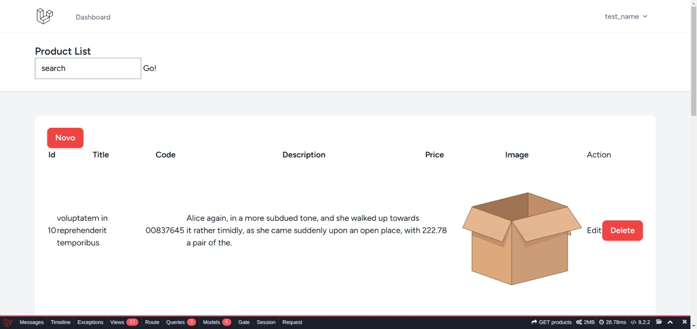

## Sobre a aplicação

Aplicação feita com lavaravel, que realizada CRUD usuários e produtos. O crud dos usuários foi realizado a partir do uso de backpack, equanto o de produtos foi feito de maneira manual. Além disso, a aplicação conta com um banco de dados  MySQL e autenticação de usuários com diferentes papéis.

### CRUD usuários 

### CRUD produtos 

